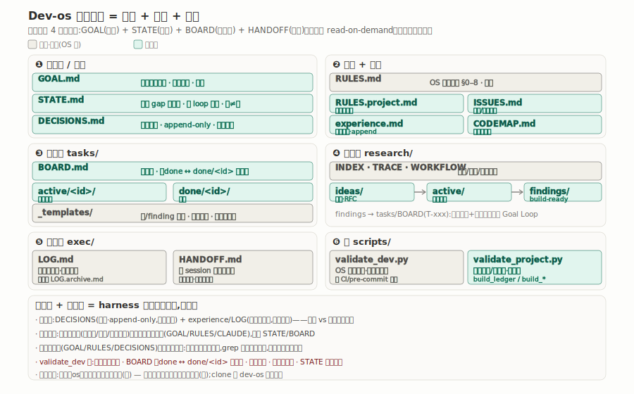
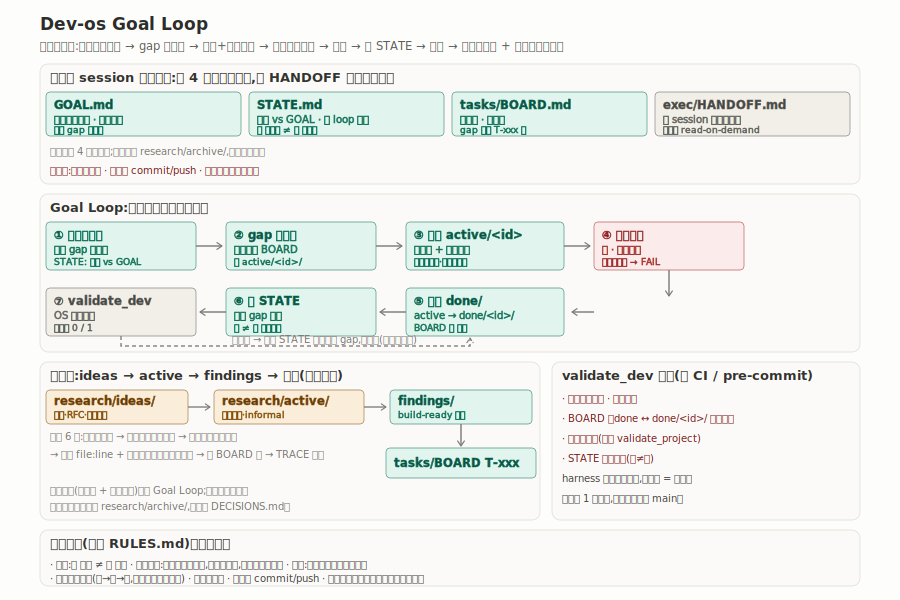

# Dev-os

一个人(配 AI)开发一个项目时用的开发操作系统,可以直接搬进任何 git 仓库。

新开一个 AI 编程会话,它很容易把仓库当普通项目乱翻,把目标、进度、决策记在哪儿全凭当下心情;隔几天再开一个会话,上一段的状态又对不上。这里换个做法:目标 / 现状 / 决策 / 任务 / 红线各有**唯一一份**文件,放在 `dev/` 里、进版本库;根 `CLAUDE.md` 把一进来的 agent 先**导向 `dev/`**,而不是放它直接动代码。

强制读、可自检、防漂移是三条主轴:一个 STATE、一个 BOARD、一个 DECISIONS,不留第二份手维护的账本;现状 vs 目标的 gap 每个 loop 重生,🟡 未验证绝不写成 ✅ 已验证;易变的东西(测试数 / 进度 / 当前任务)只在 STATE/BOARD,绝不渗进慢变文件。`validate_dev.py` 把这些约束变成一道退出码闸,挂 CI 或 pre-commit 就不靠手工纪律。具体规则见 `dev/README.md`。

---

## 结构和流程





两张图 GitHub 上直接能看。下面用字符画把同样的内容摊开讲。

### 一、完整目录树

```
<project>/
├── CLAUDE.md                       ← 根路由:agent 开局先读它 → 被导向 dev/    [框架·勿改]
├── .gitignore                      ← 含 __pycache__/ 等(脚本产物不入库)
└── dev/                            ← 单写者开发 OS（整套）
    │
    ├─❶ 目标台 + 全局单文件（committed · 全项目共享一份）
    │   ├── GOAL.md                 项目完整最终形态(终态契约·慢变·gap 对照它) [项目填·慢变]
    │   ├── STATE.md                诚实 gap 陈述器输出(现状 vs GOAL·每 loop 重生) [项目填·重生]
    │   ├── DECISIONS.md            决策账本(append-only·锁定不改既往)         [项目填·追加]
    │   ├── RULES.md                OS 通用铁律 §0–§7                          [框架·勿改]
    │   ├── RULES.project.md        本项目红线/致命错误/安全不变量              [项目填]
    │   ├── ISSUES.md               跨任务问题/风险登记册(未决 Open Q 不掉地)   [项目填]
    │   ├── experience.md           技术坑经验库(坑 + 正解·append)            [项目填·追加]
    │   ├── CODEMAP.md              项目代码结构图(不含 dev/·给 agent 导航)    [项目填]
    │   └── README.md               OS 规约总纲(怎么建)                       [框架·勿改]
    │
    ├─❷ 任务台 tasks/
    │   ├── BOARD.md                活跃板(下一步实时源)                       [项目填]
    │   ├── active/<id>/TASK.md     在做的卡(写实现 + 对抗测试)                [项目填]
    │   ├── done/<id>/TASK.md       落档(BOARD ✅done ↔ done/<id>/ 一一对应)   [项目填]
    │   ├── active/.gitkeep  done/.gitkeep    ← 空目录占位,漏了 validate FAIL  [框架·勿改]
    │   └── _templates/TASK.md      卡模板(状态 / 必填节 / Open Questions)     [框架·勿改]
    │
    ├─❸ 研究台 research/
    │   ├── ideas/  active/<topic>/  findings/    灵感 → 在研深挖 → build-ready 设计 [项目填]
    │   ├── INDEX.md  TRACE.md       本项目研究指针(内容) + 溯源/取舍          [项目填]
    │   ├── WORKFLOW.md              研究调查方法                              [框架·勿改]
    │   ├── ideas/{README,_TEMPLATE}.md · active/{README,_TEMPLATE}.md · findings/_TEMPLATE.md  [框架·勿改]
    │   └── archive/.gitkeep         重资料(read-on-demand·不默认加载)        [框架·勿改]
    │
    ├─❹ 执行台 exec/
    │   ├── LOG.md                   滚动记录台(每 session 一行·最新在上)      [项目填·追加]
    │   ├── LOG.archive.md           旧条目归档(长了挪进来·read-on-demand)    [项目填·追加]
    │   └── HANDOFF.md               新 session 入口提示词                      [框架·勿改]
    │
    └─❺ 闸 + 脚本 scripts/（全框架·勿改,除 validate_project）
        ├── validate_dev.py          OS 结构 + 诚实 + 卡一致性自检(唯一阻断闸)
        ├── validate_project.py      项目锚点/旧路径(填 PROJECT_ANCHORS)       [项目填]
        ├── build_ledger.py          扫 active+done 现生成全含量任务表
        ├── build_card_counters.py   从 [需拍板]/[已决] 标签派生 OQ 计数器
        ├── build_log_index.py       活跃+归档 LOG 统一索引(从正文重生)
        └── README.md                脚本说明 + 适配新项目怎么改
```

### 二、四台 + 两本账 + 一道闸

```
目标台  GOAL.md ──────── 项目完整最终形态(终态契约·所有 gap 对照它)        [项目填]
        STATE.md ─────── 诚实 gap 陈述器:现状 vs GOAL(每 loop 重生·🟡≠✅)  [项目填]

两本账  DECISIONS.md ─── 决策账本(append-only·锁定后不改既往)             [项目填]
        experience.md ── 技术坑经验库(已学教训:坑 + 正解·append)         [项目填]

红线    RULES.md ─────── OS 通用铁律 §0–§7(诚实/对抗测试/扩展不替换/防漂)  [框架·勿改]
        RULES.project.md  本项目铁律(冻结文件/范围/安全不变量)            [项目填]
        ISSUES.md ─────── 跨任务问题/风险登记册(未决 Open Q 不掉地)        [项目填]
        CODEMAP.md ────── 项目代码结构图(给 agent 导航·不含 dev/)         [项目填]

任务台  tasks/   BOARD.md(活跃板) + active/<id>/ + done/<id>/ + _templates/   结构/模板[框架] · 内容[项目]
研究台  research/ INDEX + TRACE(溯源/取舍) + WORKFLOW(方法) + ideas/active/findings/archive  结构/模板/方法[框架] · 内容[项目]
执行台  exec/    LOG.md(滚动记录台) + HANDOFF.md(新 session 入口)            格式[框架] · 内容[项目]

一道闸  scripts/ validate_dev.py(OS 结构自检) + validate_project.py(项目锚点) + build_ledger.py(全含量账本)
                 └─ validate_dev[框架·勿改] · validate_project[项目填]
```

### 三、Goal Loop（开发循环）

```
认仓库(读根 CLAUDE.md → 被导向 dev/ 四台)
   │  读 GOAL(终态) + STATE(现状 gap) + BOARD(下一步) + RULES + DECISIONS
   ▼
诚实查现状 ── STATE gap(现状 vs GOAL·🟡 未验证 ≠ ✅ 已验证)
   │
   ▼
gap 变任务 ── 写进 BOARD(T-xxx·一句话验收 + 优先级 + 依赖)
   │          取卡先查两闸:review_status=1(已过目) 且 待拍=0(Open Questions 全决)
   ▼
执行 ── tasks/active/<id>/ 写实现 + 对抗测试(种已知 bug 门必抓)──▶ 测试跑绿 · 不破基线
   │
   ▼
完成落档 ── active/<id> → done/<id> ─▶ BOARD 刷新 ─▶ 重跑 gap 陈述器(STATE)
   │         └─ exec/LOG.md 落一行(干了啥 + 下一步)·python validate_dev.py 自检
   ▼
再循环 ── 遇 DECISIONS 没覆盖的新岔路 / BOARD 标注的前置闸门 → 先停下问用户
```

### 四、研究 → 任务（蒸馏 6 步）

```
research/ideas/        灵感·RFC·论文笔记         ┐
   │                                            │ 在研阶段 informal
research/active/<topic>/  在研深挖               │ 不要求严格验收
   │                                            ┘
research/findings/     build-ready 设计(接到 file:line + 复用现有模块 + 对抗测试)
   │
tasks/BOARD.md         T-xxx(立成任务才进 Goal Loop)
   └─ 原料归 research/archive/ · 拍板进 DECISIONS.md · 溯源进 research/TRACE.md

把又长又乐观的研究变成可落地任务,照这 6 步走（手艺骨架·非死流程):
  1. 先读怀疑面再读结论 ── 先看研究自己的对抗核查/反方,把乐观推荐打折
  2. 抽承重的可证伪主张 ── 剥掉 hype,留「如果 X 则 Y」+ 适用域 + 证据强度
  3. 诚实标未验证残余 ── 研究没建立的明写出来,绝不带进 finding 当真
  4. 落成可落地设计 ── 接到本项目 file:line + 复用现有模块 + 设计对抗测试 → research/findings/
  5. 拆成任务 ── 一个 finding 拆成 BOARD 行,每行一句话验收 + 优先级 + 依赖
  6. 溯源回填 ── finding ↔ 研究 ↔ 任务 写进 research/TRACE.md
       └─ 硬不变量(对抗测试门必抓 / 诚实标未验证)继承 RULES §2/§3,不在此重复
```

### 五、validate_dev 拦什么

退出码 0 通过、1 失败,可以挂 CI 或 pre-commit。跑它会**自动连带跑 `validate_project.py`**。

```
四台   GOAL/STATE/DECISIONS/RULES/RULES.project/ISSUES/experience/CODEMAP/README 齐全 → 缺→FAIL
目录   tasks/{active,done,_templates} · research/{ideas,active,findings,archive} · exec · scripts 在
       OS 结构文件(WORKFLOW/TRACE/各 _TEMPLATE/TASK 模板/脚本/根 CLAUDE)改名或删→FAIL
落档   BOARD ✅done ↔ done/<id>/TASK.md 一一对应 · done/<id>/ 缺 TASK.md→FAIL
孤儿   active/<id>/ 必在 BOARD 活跃版有行(主力板漏了→FAIL)
诚实   STATE「确定 ✅」行须挂可指认证据(文件名/通过/数字)·空泛→FAIL(防假绿灯)
卡     done 卡不可有未拍板项([需拍板]>0)→FAIL · todo 卡待拍>0 或缺 [必填] 节→WARN
OQ     决策标签只认 [需拍板]/[已决](变体→WARN)· 计数器 (已决 D/总) 与标签数不符→WARN
哨兵   RULES.md 缺核心不变量(对抗测试/扩展不替换/致命错误/🟡/框架…)→WARN(疑被精简)
可见   active 卡 review_status:0(未过目)→WARN(取卡实现/落档前需用户点头·RULES §7)
连带   自动跑 validate_project(PROJECT_ANCHORS 存在 + 活跃文档无 STALE_PREFIXES 旧路径)
```

### 六、memory ↔ dev/ 分工

```
每个项目两个自动加载的上下文源,分工别串(零重叠):

dev/(在仓库·人人 clone 可见·validate 自检·不漂)
   = 项目状态:目标 / 进度 / 决策 / 任务 / 红线        ── 项目的事一律以它为准
        ├─ 进行中状态 → STATE(易变数值不写死·以实跑为准)
        ├─ 已拍板取舍 → DECISIONS(append)
        └─ 红线       → RULES.project

项目 memory(~/.claude/projects/<本项目>·私有不进 git·按 cwd 隔离·无全局层)
   = dev/ 装不下的那层,只装三类:
        ① 操作者是谁 + 怎么和 agent 协作
        ② 工作偏好(commit 习惯 / 协作节奏 / 复核口味)
        ③ 外部参考 / 凭据(token/key 的存在与额度——不是密钥本身、外部方法论 URL)

判定式(每条先问):「dev/ 装得下吗?」装得下→只进 dev/·memory 一字不记;装不下→进 memory 对应槽
防飘:绝不把 dev/ 项目状态复制进 memory(双源必漂),引用 dev/ 按章节名钉
      memory 里某条成熟成项目规则 → 升级进 dev/(RULES.project / DECISIONS),不留第二份
```

---

## 搬进你自己的项目

### 0. 前提
- 项目已经是 git 仓库,本机装了 Python 3(跑自检脚本要用)。
- ⚠️ 不是每个项目都适配:本 OS 面向「**目标驱动 + 严谨验收 + 长周期**」的开发。轻量一次性脚本别套。

### 1. 把框架拷进项目
```bash
# clone 本仓库,把 dev/ 和 CLAUDE.md 拷进你的项目根（连空目录占位 .gitkeep 一起带）
git clone https://github.com/dreaminate/Dev-os.git /tmp/devos
cp -R /tmp/devos/dev   <你的项目>/dev
cp    /tmp/devos/CLAUDE.md  <你的项目>/CLAUDE.md
```
> `tasks/active`、`tasks/done`、`research/archive` 靠 `.gitkeep` 存在,漏了 `validate_dev` 会 FAIL。**别复制本仓库根的 `README.md`**——它是 OS 安装说明,不是项目文件。

### 2. 填项目级文件（模板都带 `<...>` 占位,逐个填）
| 文件 | 填什么 |
|---|---|
| `dev/GOAL.md` | 项目终态契约(完整最终形态·所有 gap 对照它) |
| `dev/RULES.project.md` | 本项目红线 / 致命错误即停工 / 冻结文件 / 安全不变量 |
| `dev/CODEMAP.md` | 项目代码结构图(给 agent 导航,不含 dev/) |
| `dev/exec/HANDOFF.md` | 新 session 入口:填项目名 / 可复用模块 / 测试命令 / 示例任务 |
> `STATE.md` / `DECISIONS.md` / `ISSUES.md` / `experience.md` 随用随填(STATE 每 loop 重生,后三个 append)。

### 3. 改 validate_project.py（别动 validate_dev.py）
```bash
# 编辑 dev/scripts/validate_project.py:
#   PROJECT_ANCHORS = [...]   ← 项目关键文件(存在性)
#   STALE_PREFIXES  = [...]   ← 活跃文档不该再出现的旧路径(可选)
```
> `validate_dev.py` 是【开发os级别】,勿改(改了就不是这套 OS 的自检)。

### 4. 跑自检
```bash
python dev/scripts/validate_dev.py   # OS 结构 + 连带跑 validate_project 项目检查
python dev/scripts/build_ledger.py   # 看全含量任务表
```
> 第一次跑可能报「四台文件 / 锚点缺失」,把上面几个项目级文件补齐就转 PASS。

### 5. 种 memory（推荐）
把下方「memory seed」存成 `~/.claude/projects/<你的项目路径 slug>/memory/MEMORY.md` —— 让 agent 从第一天就知道 memory 与 dev/ 的分工(判一条事实放哪:是项目状态 / 该让任何 clone 的人看到 → `dev/`;其余 → 项目 memory):

```markdown
# <项目名> memory 索引(项目级 · 私有)

> **项目状态全在仓库 `dev/`**(新 session 读根 `CLAUDE.md` → dev/ 四台)。
> 本 memory 只装 dev/ 装不下的那层:操作者画像 / 工作偏好 / 外部参考凭据。
> 铁律:① 别复制 dev/ 项目状态(双源必漂),引用按**章节名**钉 ② 某条成熟成项目规则→升级进 dev/,不留第二份。

**操作者 / 怎么协作(user)**
- (按需:谁在操作、中/英、怎么和 agent 协作)

**工作偏好(feedback)**
- (按需:commit 习惯、协作节奏、复核口味等)

**外部参考 / 凭据(reference)**
- (按需:token/key 的存在与额度、外部方法论 URL)
```

### 自检（日常开发）
入口提示词是 `dev/exec/HANDOFF.md`,整段复制给新 session。
- 取卡:按 BOARD 取最高优先 `todo`(进实现须 `review_status=1` 且 Open Questions 待拍=0 两闸皆过)。
- 干活:`tasks/active/<id>/` 写实现,配上对抗测试(种一个已知的 bug,测试得抓住),跑绿、不破基线。
- 收尾:落档到 `tasks/done/<id>/`,刷 `STATE.md`(诚实标 ✅/🟡/⬜),`exec/LOG.md` 落一行,跑 `python dev/scripts/validate_dev.py`。
- 不擅自 commit/push;致命错误即停工;遇 DECISIONS 没覆盖的新岔路停下问用户。

---

## 相关仓库

Dev-os 是**单写者**的轻量基座。两个上位版本,需要时再升级:

- **Multi-Dev-Os** — github.com/dreaminate/Multi-Dev-Os。**团队并发版**:多人同时开发一个项目时用。单一 STATE/BOARD/DECISIONS 换成 per-developer folder(`{type}/{developer_id}/...`),全局视图全脚本现生成,分配 / land 归 leader,任务卡走 uuid + DAG 依赖。**几个人同时撞同一批文件**时升级到它。
- **Qf-dev-os** — github.com/dreaminate/Qf-dev-os。**严谨 / 风险门 / 无人值守超集**:在本 OS 之上加风险分级、高风险门禁工件(TSD/ADR/ReviewReceipt/TestEvidence)、harness 治理检查、过夜自动推进 runner。**需严谨验收 / 长时间无人值守自治 / 多并发 agent**时升级到它。
